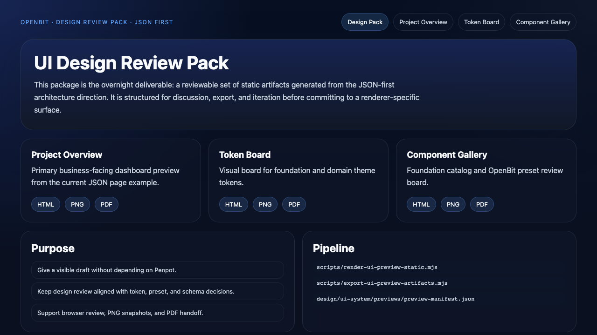
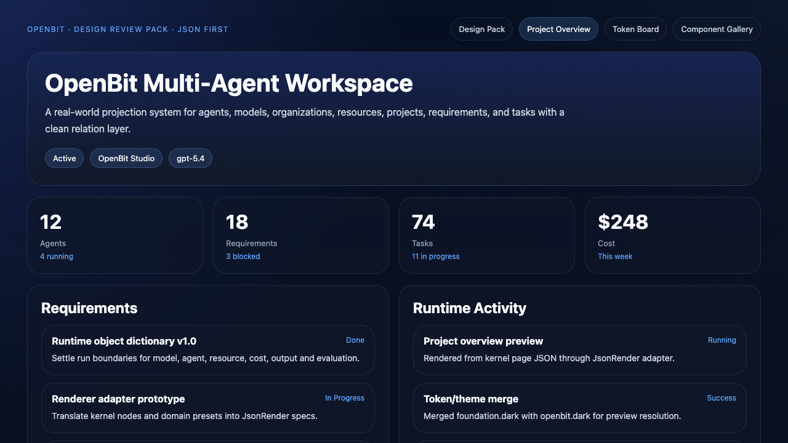
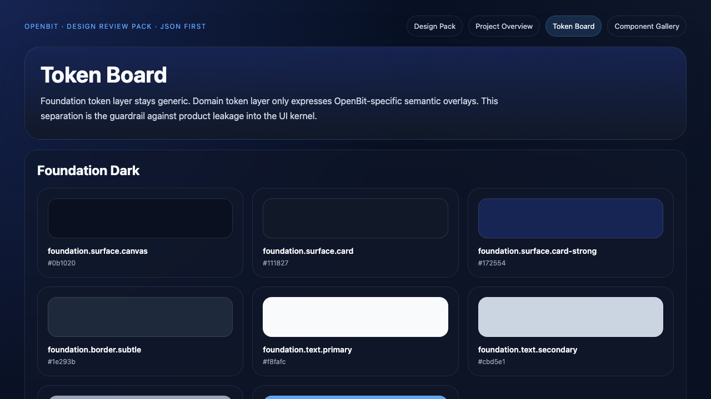
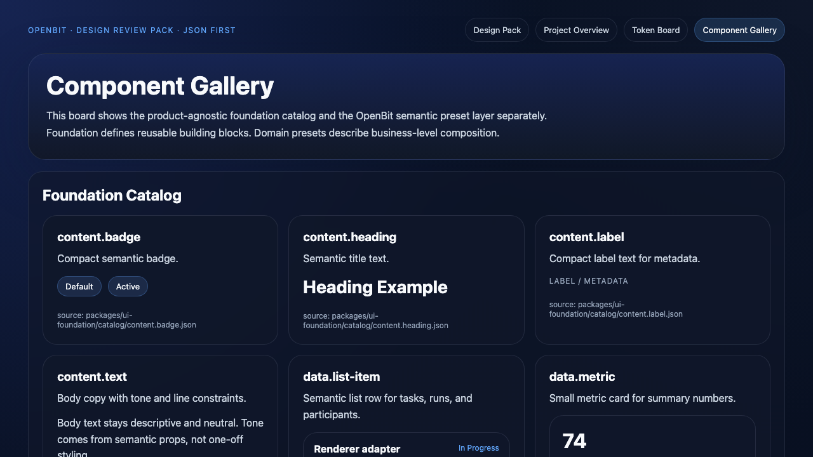

# OpenBit Design

Public design language and prototype previews for OpenBit.

## Preview Pack

- [Design Pack Index](./previews/index.html)
- [Project Overview](./previews/project-overview.html)
- [Token Board](./previews/token-board.html)
- [Component Gallery](./previews/component-gallery.html)

PNG snapshots:

- 
- 
- 
- 

## Published Scope

- architecture and design docs
- foundation catalog and token contracts
- domain presets and theme overlays
- static preview artifacts

This repo intentionally excludes application runtime code and workspace-private implementation details.
